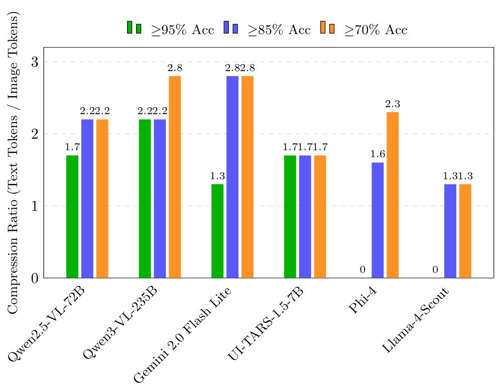

# Un-LOCC: Universal Lossy Optical Context Compression for Vision-Based Language Models

### Achieve nearly 3x token compression at over 93% retrieval accuracy using existing Vision-Language Models.
## Star History

[](https://www.star-history.com/#MaxDevv/Un-LOCC&type=date&legend=top-left) 

## Abstract

The quadratic computational complexity of the Transformer attention mechanism makes large context LLM inferences prohibitively costly. This project, inspired by the research of DeepSeek-OCR, investigates a practical method for LLM context compression by rendering text as an image. The core hypothesis is that an image, which has a fixed token cost for a Vision-Language Model (VLM), can serve as a highly compressed representation of a much larger body of text. I introduce the "Optical Needle in a Haystack" (O-NIH) evaluation framework to systematically optimize and quantify the performance of this technique. Through extensive experimentation with variables including font family, color contrast, image resolution, and font size, I've identified some optimal configurations. These results show that it is possible to achieve compression ratios approaching 3:1 (e.g., **2.8:1** in Experiment 56) while maintaining over **93% retrieval accuracy**. This demonstrates that Optical Compression is a viable, plug-and-play strategy for drastically extending the effective context length and reducing the operational cost of existing VLMs.

## Key Results

Analysis of over 90 experiments reveals that different models have unique "sweet spots" for optical compression. However, a general trend emerges: high-fidelity compression is achievable across multiple state-of-the-art VLMs.



_Figure 1: Maximum compression ratios achieved by top vision-language models at different accuracy thresholds._


| Model                             | Peak Performance<br/>(Max Accuracy) | High-Fidelity Compression<br/>(Max Ratio @ >=85%) | High-Density Compression<br/>(Max Ratio @ >=70%) |
| :-------------------------------- | :--------------------------------- | :----------------------------------------------- | :----------------------------------------------- |
| **qwen/qwen2.5-vl-72b-instruct**  | **98.33%** @ 1.7:1 (Exp 44)        | **2.2:1** @ 94.44% (Exp 81)                      | **2.2:1** @ 94.44% (Exp 81)                      |
| **qwen/qwen3-vl-235b-a22b**       | **95.24%** @ 2.2:1 (Exp 50)        | **2.2:1** @ 95.24% (Exp 50)                      | **2.8:1** @ 82.22% (Exp 90)                      |
| **google/gemini-2.0-flash-lite**  | **100.0%** @ 1.3:1 (Exp 46)        | **2.8:1** @ 93.65% (Exp 56)                      | **2.8:1** @ 93.65% (Exp 56)                      |
| **bytedance/ui-tars-1.5-7b**      | **95.24%** @ 1.7:1 (Exp 72)        | **1.7:1** @ 95.24% (Exp 72)                      | **1.7:1** @ 79.71% (Exp 88)                      |
| **microsoft/phi-4-multimodal**    | **94.44%** @ 1.1:1 (Exp 59, 85)    | **1.6:1** @ 91.11% (Exp 63)                      | **2.3:1** @ 73.55% (Exp 61)                      |
| **meta-llama/llama-4-scout**      | **86.57%** @ 1.3:1 (Exp 53)        | **1.3:1** @ 86.57% (Exp 53)                      | **1.3:1** @ 86.57% (Exp 53)                      |


### Per-Model Optimization Summary

While optimal variables vary, This research provides a strong starting point for applying this technique:

-   **Image Size:** The best results are often achieved when the input image resolution is slightly smaller than the model's maximum supported single-tile resolution. This avoids the model chunking the image into multiple sections, which is inefficient for this task. An image size of **864x864 pixels** proved to be an excellent and high-performing default for many models.
-   **Font Size:** A font size between **12px and 16px** is generally optimal. The exact sweet spot depends on the model's perceptual acuity. For `qwen/qwen2.5-vl-72b-instruct`, 13px was the clear winner (Experiment 81), while for the highly efficient `google/gemini-2.0-flash-lite`, a smaller 12px font yielded outstanding results (Experiment 56).
-   **Font Family:** Font choice has a massive effect on legibility. High-legibility, sans-serif fonts are critical. Tests (Experiments 6-19) consistently showed top performance from:
    1.  **Atkinson Hyperlegible** (especially the Italic variant, see Experiment 19 vs 17)
    2.  **Lato** (Experiment 12)
    3.  **Lexica Ultralegible** (especially the Italic variant, see Experiment 27)
-   **Color Contrast:** Color had a minimal positive impact compared to standard black-on-white. Ablation studies (Experiments 20-25) confirmed that high-contrast combinations like black-on-white or yellow-on-blue perform best, while low-contrast pairs (e.g., red-on-blue) fail completely.

## The O-NIH Methodology

The core challenge of this research was to create a reliable method for testing a model’s text processing capabilities across different image configurations. Standard transcription tasks are inefficient and prone to model failure modes like repetition. To solve this, I developed the **Optical Needle in a Haystack (O-NIH)** test.

The O-NIH test works by injecting a unique, non-contextual code (the "needle") into a large, cohesive body of text (the "haystack"). The VLM is then tasked with retrieving only that code. This transforms the problem from one of costly generation to one of efficient retrieval.

The haystack and needle are prepared programmatically, as shown below:

```python
import random

def generate_needle(length=9):
    """Generates a random, unique code (the 'needle')."""
    chars = 'ABCDEFGHJKLMNPQRSTUVWXYZ23456789'
    result = ''
    for i in range(length):
        result += random.choice(chars)
        if (i + 1) % 3 == 0 and i < length - 1:
            result += '-'
    return result

def prepare_text(source_text, word_count):
    """Extracts a random chunk of text and injects the needle."""
    words = source_text.split()
    if len(words) < word_count:
        raise ValueError(f"Source text is too short.")

    start_index = random.randint(0, len(words) - word_count)
    text_chunk = words[start_index : start_index + word_count]
    
    needle = generate_needle()
    # Inject the needle at a random position within the text chunk
    injection_index = random.randint(1, len(text_chunk) - 1)
    text_chunk.insert(injection_index, needle)
    
    haystack = " ".join(text_chunk)
    return haystack, needle
```

The model's accuracy is then graded using a "fuzzy" comparison that accounts for common OCR errors (e.g., mistaking 'I' for '1') by calculating the Levenshtein distance between a normalized version of the expected and received codes.

```python
def normalize_for_ocr(text):
    """Normalizes a string to account for common OCR errors."""
    replacements = {
        'O': '0', 'o': '0', 'I': '1', 'l': '1', 'S': '5', 's': '5',
        'B': '8', 'A': '4', '-': '', ' ': ''
    }
    text = text.upper()
    for old, new in replacements.items():
        text = text.replace(old, new)
    return text

def fuzzy_similarity(s1, s2):
    """Calculates a normalized similarity score based on Levenshtein distance."""
    norm_s1 = normalize_for_ocr(s1)
    norm_s2 = normalize_for_ocr(s2)
    distance = levenshtein_distance(norm_s1, norm_s2) # Standard Levenshtein implementation
    max_len = max(len(norm_s1), len(norm_s2))
    if max_len == 0: return 1.0
    return (max_len - distance) / max_len
```

## Limitations

-   **Contextual Understanding:** This technique tests perceptual retrieval, not deep contextual understanding. While a model can *find* text, its ability to reason over the optically compressed context may be different than with standard text tokens. This method is best suited for compressing historical context where the primary need is recall, not complex reasoning.
-   **Prompt Injection Risk:** Similar to other image-based inputs, this technique could potentially be used to circumvent safety filters by rendering harmful text within an image.

## Vision & Future Work

The field of Lossy Optical Context Compression is new and exciting. Its primary advantage is that it can be applied to existing models without any fine-tuning, offering an immediate path to reducing costs and increasing context length for developers everywhere.

The strong performance of smaller models like **Phi-4 Multimodal** opens a particularly exciting avenue for **on-device context expansion**. By offloading historical context to an optically compressed image, it may be possible to run agents with vast memory on edge devices with limited VRAM.

I believe this technique can have a wide array of applications. I foresee a series of libraries that wrap around existing API and SDK interactions to make large-context, low-cost VLM inference easily accessible. This could expand access to frontier models and drastically reduce the performance requirements for local models. I hope that this research is able to help create this future of reduced costs and increased accessibility.

## Acknowledgements

This project would not have been possible without the foundational ideas presented in the **DeepSeek-OCR** paper ("Contexts Optical Compression"). Their work provided the initial spark that demonstrated the feasibility of representing large amounts of text in a compressed optical format, paving the way for the research presented here.


## Appendix: All Experiments

*A raw log of every experiment performed during the optimization process. The same prompt was used for every call (Can be found in main.py). This data provides full transparency into the exploratory process that led to the final conclusions, including all my cheezy notes :D.*
<details>
  <summary>Click to expand</summary>

**Experiment 1:**
- Input:
    - Image: 768x768px, 317 Image Tokens, Consisting of 200 words ≈ 267 text tokens
    - Model: google/gemma-3-4b-it
    - Font: Verdana.ttf
- Results:
    - Token Compression Ratio: 0.8:1 Image Tokens -> Text Token
    - An average of 52.38% Accuracy Over 7 Trials

**Experiment 2:**
- Input:
    - Image: 768x768px, 869 Image Tokens, Consisting of 1000 words ≈ 1333 text tokens
    - Model: mistralai/mistral-small-3.1-24b-instruct
    - Font: Verdana.ttf
- Results:
    - Token Compression Ratio: 1.5:1 Image Tokens -> Text Token
    - An average of 80.95% Accuracy Over 7 Trials

**Experiment 3:**
- Input:
    - Image: 768x768px, 869 Image Tokens, Consisting of 5000 words ≈ 6667 text tokens
    - Model: mistralai/mistral-small-3.1-24b-instruct
    - Font: Verdana.ttf
- Results:
    - Token Compression Ratio: 7.7:1 Image Tokens -> Text Token
    - An average of 30.94% Accuracy Over 12 Trials

**Experiment 4:**
- Input:
    - Image: 1540x1540px, 2665 Image Tokens, Consisting of 5000 words ≈ 6667 text tokens
    - Model: qwen/qwen2.5-vl-72b-instruct
    - Font: Verdana.ttf
- Results:
    - Token Compression Ratio: 2.5:1 Image Tokens -> Text Token
    - An average of 36.89% Accuracy Over 25 Trials

**Experiment 5:**
- Input:
    - Image: 1024x1024px, 1439 Image Tokens, Consisting of 3000 words ≈ 4000 text tokens
    - Model: qwen/qwen2.5-vl-72b-instruct
    - Font: Verdana.ttf
- Results:
    - Token Compression Ratio: 2.8:1 Image Tokens -> Text Token
    - An average of 34.56% Accuracy Over 10 Trials

**Experiment 6:**
- Input:
    - Image: 324x324px, 214 Image Tokens, Consisting of 500 words ≈ 667 text tokens
    - Model: qwen/qwen2.5-vl-72b-instruct
    - Font: AtkinsonHyperlegible-Regular.ttf
- Results:
    - Token Compression Ratio: 3.1:1 Image Tokens -> Text Token
    - An average of 40.17% Accuracy Over 13 Trials

**Experiment 7:**
- Input:
    - Image: 324x324px, 214 Image Tokens, Consisting of 500 words ≈ 667 text tokens
    - Model: qwen/qwen2.5-vl-72b-instruct
    - Font: AtkinsonHyperlegible-Italic.ttf
- Results:
    - Token Compression Ratio: 3.1:1 Image Tokens -> Text Token
    - An average of 44.61% Accuracy Over 20 Trials

**Experiment 8:**
- Input:
    - Image: 324x324px, 214 Image Tokens, Consisting of 500 words ≈ 667 text tokens
    - Model: qwen/qwen2.5-vl-72b-instruct
    - Font: AtkinsonHyperlegible-BoldItalic.ttf
- Results:
    - Token Compression Ratio: 3.1:1 Image Tokens -> Text Token
    - An average of 24.44% Accuracy Over 10 Trials

**Experiment 9:**
- Input:
    - Image: 324x324px, 214 Image Tokens, Consisting of 500 words ≈ 667 text tokens
    - Model: qwen/qwen2.5-vl-72b-instruct
    - Font: Inter-Italic-VariableFont_opsz,wght.ttf
- Results:
    - Token Compression Ratio: 3.1:1 Image Tokens -> Text Token
    - An average of 26.45% Accuracy Over 10 Trials

**Experiment 10:**
- Input:
    - Image: 324x324px, 214 Image Tokens, Consisting of 500 words ≈ 667 text tokens
    - Model: qwen/qwen2.5-vl-72b-instruct
    - Font: NotoSans-VariableFont_wdth,wght.ttf
- Results:
    - Token Compression Ratio: 3.1:1 Image Tokens -> Text Token
    - An average of 5.55% Accuracy Over 10 Trials

**Experiment 11:**
- Input:
    - Image: 324x324px, 214 Image Tokens, Consisting of 500 words ≈ 667 text tokens
    - Model: qwen/qwen2.5-vl-72b-instruct
    - Font: NotoSans-Regular.ttf
- Results:
    - Token Compression Ratio: 3.1:1 Image Tokens -> Text Token
    - An average of 4.44% Accuracy Over 10 Trials

**Experiment 12:**
- Input:
    - Image: 324x324px, 214 Image Tokens, Consisting of 500 words ≈ 667 text tokens
    - Model: qwen/qwen2.5-vl-72b-instruct
    - Font: Lato-Regular.ttf
- Results:
    - Token Compression Ratio: 3.1:1 Image Tokens -> Text Token
    - An average of 47.78% Accuracy Over 10 Trials

**Experiment 13:**
- Input:
    - Image: 324x324px, 214 Image Tokens, Consisting of 500 words ≈ 667 text tokens
    - Model: qwen/qwen2.5-vl-72b-instruct
    - Font: Lato-LightItalic.ttf
- Results:
    - Token Compression Ratio: 3.1:1 Image Tokens -> Text Token
    - An average of 20.0% Accuracy Over 10 Trials

**Experiment 14:**
- Input:
    - Image: 324x324px, 214 Image Tokens, Consisting of 500 words ≈ 667 text tokens
    - Model: qwen/qwen2.5-vl-72b-instruct
    - Font: Lato-Italic.ttf
- Results:
    - Token Compression Ratio: 3.1:1 Image Tokens -> Text Token
    - An average of 31.11% Accuracy Over 10 Trials

**Experiment 15:**
- Input:
    - Image: 324x324px, 214 Image Tokens, Consisting of 500 words ≈ 667 text tokens
    - Model: qwen/qwen2.5-vl-72b-instruct
    - Font: Roboto-Regular.ttf
- Results:
    - Token Compression Ratio: 3.1:1 Image Tokens -> Text Token
    - An average of 9.51% Accuracy Over 10 Trials

**Experiment 16:**
- Input:
    - Image: 324x324px, 214 Image Tokens, Consisting of 500 words ≈ 667 text tokens
    - Model: qwen/qwen2.5-vl-72b-instruct
    - Font: Lato-Regular.ttf
- Results:
    - Token Compression Ratio: 3.1:1 Image Tokens -> Text Token
    - An average of 35.42% Accuracy Over 16 Trials
- Notes:
    - "{exp[0][-2]}" 

**Experiment 17:**
- Input:
    - Image: 324x324px, 214 Image Tokens, Consisting of 500 words ≈ 667 text tokens
    - Model: qwen/qwen2.5-vl-72b-instruct
    - Font: AtkinsonHyperlegible-Regular.ttf
- Results:
    - Token Compression Ratio: 3.1:1 Image Tokens -> Text Token
    - An average of 23.61% Accuracy Over 16 Trials
- Notes:
    - "{exp[0][-2]}" 

**Experiment 18:**
- Input:
    - Image: 324x324px, 214 Image Tokens, Consisting of 500 words ≈ 667 text tokens
    - Model: qwen/qwen2.5-vl-72b-instruct
    - Font: Lato-Regular.ttf
- Results:
    - Token Compression Ratio: 3.1:1 Image Tokens -> Text Token
    - An average of 20.11% Accuracy Over 30 Trials
- Notes:
    - "{exp[0][-2]}" 

**Experiment 19:**
- Input:
    - Image: 324x324px, 214 Image Tokens, Consisting of 500 words ≈ 667 text tokens
    - Model: qwen/qwen2.5-vl-72b-instruct
    - Font: AtkinsonHyperlegible-Italic.ttf
- Results:
    - Token Compression Ratio: 3.1:1 Image Tokens -> Text Token
    - An average of 30.91% Accuracy Over 69 Trials
- Notes:
    - "{exp[0][-2]}" 

**Experiment 20:**
- Input:
    - Image: 324x324px, 214 Image Tokens, Consisting of 500 words ≈ 667 text tokens
    - Model: qwen/qwen2.5-vl-72b-instruct
    - Font: Roboto-Regular.ttf
- Results:
    - Token Compression Ratio: 3.1:1 Image Tokens -> Text Token
    - An average of 15.56% Accuracy Over 10 Trials
- Notes:
    - "{exp[0][-2]}" 

**Experiment 21:**
- Input:
    - Image: 324x324px, 214 Image Tokens, Consisting of 500 words ≈ 667 text tokens
    - Model: qwen/qwen2.5-vl-72b-instruct
    - Font: AtkinsonHyperlegible-Italic.ttf
- Results:
    - Token Compression Ratio: 3.1:1 Image Tokens -> Text Token
    - An average of 24.45% Accuracy Over 10 Trials
- Notes:
    - "{exp[0][-2]}" 

**Experiment 22:**
- Input:
    - Image: 324x324px, 214 Image Tokens, Consisting of 500 words ≈ 667 text tokens
    - Model: qwen/qwen2.5-vl-72b-instruct
    - Font: AtkinsonHyperlegible-Italic.ttf
- Results:
    - Token Compression Ratio: 3.1:1 Image Tokens -> Text Token
    - An average of 5.55% Accuracy Over 10 Trials
- Notes:
    - "{exp[0][-2]}" 

**Experiment 23:**
- Input:
    - Image: 324x324px, 214 Image Tokens, Consisting of 500 words ≈ 667 text tokens
    - Model: qwen/qwen2.5-vl-72b-instruct
    - Font: AtkinsonHyperlegible-Italic.ttf
- Results:
    - Token Compression Ratio: 3.1:1 Image Tokens -> Text Token
    - An average of 5.55% Accuracy Over 10 Trials
- Notes:
    - "{exp[0][-2]}" 

**Experiment 24:**
- Input:
    - Image: 324x324px, 214 Image Tokens, Consisting of 500 words ≈ 667 text tokens
    - Model: qwen/qwen2.5-vl-72b-instruct
    - Font: AtkinsonHyperlegible-Italic.ttf
- Results:
    - Token Compression Ratio: 3.1:1 Image Tokens -> Text Token
    - An average of 20.0% Accuracy Over 25 Trials
- Notes:
    - "{exp[0][-2]}" 

**Experiment 25:**
- Input:
    - Image: 324x324px, 214 Image Tokens, Consisting of 500 words ≈ 667 text tokens
    - Model: qwen/qwen2.5-vl-72b-instruct
    - Font: AtkinsonHyperlegible-Italic.ttf
- Results:
    - Token Compression Ratio: 3.1:1 Image Tokens -> Text Token
    - An average of 13.16% Accuracy Over 10 Trials
- Notes:
    - "{exp[0][-2]}" 

**Experiment 26:**
- Input:
    - Image: 324x324px, 214 Image Tokens, Consisting of 500 words ≈ 667 text tokens
    - Model: qwen/qwen2.5-vl-72b-instruct
    - Font: LexicaUltralegible-Regular.ttf
- Results:
    - Token Compression Ratio: 3.1:1 Image Tokens -> Text Token
    - An average of 22.96% Accuracy Over 15 Trials
- Notes:
    - "{exp[0][-2]}" 

**Experiment 27:**
- Input:
    - Image: 324x324px, 214 Image Tokens, Consisting of 500 words ≈ 667 text tokens
    - Model: qwen/qwen2.5-vl-72b-instruct
    - Font: LexicaUltralegible-Italic.ttf
- Results:
    - Token Compression Ratio: 3.1:1 Image Tokens -> Text Token
    - An average of 43.85% Accuracy Over 15 Trials
- Notes:
    - "{exp[0][-2]}" 

**Experiment 28:**
- Input:
    - Image: 324x324px, 214 Image Tokens, Consisting of 500 words ≈ 667 text tokens
    - Model: qwen/qwen2.5-vl-72b-instruct
    - Font: LexicaUltralegible-Italic.ttf
- Results:
    - Token Compression Ratio: 3.1:1 Image Tokens -> Text Token
    - An average of 34.47% Accuracy Over 39 Trials
- Notes:
    - "{exp[0][-2]}" 

**Experiment 29:**
- Input:
    - Image: 700x700px, 695 Image Tokens, Consisting of 1000 words ≈ 1333 text tokens
    - Model: qwen/qwen2.5-vl-72b-instruct
    - Font: AtkinsonHyperlegible-Italic.ttf
- Results:
    - Token Compression Ratio: 1.9:1 Image Tokens -> Text Token
    - An average of 77.71% Accuracy Over 15 Trials

**Experiment 30:**
- Input:
    - Image: 700x700px, 695 Image Tokens, Consisting of 1200 words ≈ 1600 text tokens
    - Model: qwen/qwen2.5-vl-72b-instruct
    - Font: AtkinsonHyperlegible-Italic.ttf
- Results:
    - Token Compression Ratio: 2.3:1 Image Tokens -> Text Token
    - An average of 51.85% Accuracy Over 15 Trials
- Notes:
    - "{exp[0][-2]}" 

**Experiment 31:**
- Input:
    - Image: 700x14px, 1597 Image Tokens, Consisting of 40 words ≈ 53 text tokens
    - Model: qwen/qwen2.5-vl-72b-instruct
    - Font: AtkinsonHyperlegible-Italic.ttf
- Results:
    - Token Compression Ratio: 0.0:1 Image Tokens -> Text Token
    - An average of 0.0% Accuracy Over 8 Trials
- Notes:
    - "{exp[0][-2]}" 

**Experiment 32:**
- Input:
    - Image: 400x400px, 266 Image Tokens, Consisting of 400 words ≈ 533 text tokens
    - Model: qwen/qwen2.5-vl-72b-instruct
    - Font: AtkinsonHyperlegible-Italic.ttf
- Results:
    - Token Compression Ratio: 2.0:1 Image Tokens -> Text Token
    - An average of 80.93% Accuracy Over 15 Trials
- Notes:
    - "{exp[0][-2]}" 

**Experiment 33:**
- Input:
    - Image: 1000x1000px, 1366 Image Tokens, Consisting of 1250 words ≈ 1667 text tokens
    - Model: qwen/qwen2.5-vl-72b-instruct
    - Font: AtkinsonHyperlegible-Italic.ttf
- Results:
    - Token Compression Ratio: 1.2:1 Image Tokens -> Text Token
    - An average of 97.04% Accuracy Over 15 Trials
- Notes:
    - "{exp[0][-2]}" 

**Experiment 34:**
- Input:
    - Image: 1000x1000px, 1366 Image Tokens, Consisting of 1400 words ≈ 1867 text tokens
    - Model: qwen/qwen2.5-vl-72b-instruct
    - Font: AtkinsonHyperlegible-Italic.ttf
- Results:
    - Token Compression Ratio: 1.4:1 Image Tokens -> Text Token
    - An average of 99.26% Accuracy Over 15 Trials
- Notes:
    - "{exp[0][-2]}" 

**Experiment 35:**
- Input:
    - Image: 1000x1000px, 1366 Image Tokens, Consisting of 1800 words ≈ 2400 text tokens
    - Model: qwen/qwen2.5-vl-72b-instruct
    - Font: AtkinsonHyperlegible-Italic.ttf
- Results:
    - Token Compression Ratio: 1.8:1 Image Tokens -> Text Token
    - An average of 96.3% Accuracy Over 15 Trials
- Notes:
    - "{exp[0][-2]}" 

**Experiment 36:**
- Input:
    - Image: 1000x1000px, 1366 Image Tokens, Consisting of 2500 words ≈ 3333 text tokens
    - Model: qwen/qwen2.5-vl-72b-instruct
    - Font: AtkinsonHyperlegible-Italic.ttf
- Results:
    - Token Compression Ratio: 2.4:1 Image Tokens -> Text Token
    - An average of 66.67% Accuracy Over 15 Trials
- Notes:
    - "{exp[0][-2]}" 

**Experiment 37:**
- Input:
    - Image: 1500x1500px, 2986 Image Tokens, Consisting of 5000 words ≈ 6667 text tokens
    - Model: qwen/qwen2.5-vl-72b-instruct
    - Font: AtkinsonHyperlegible-Italic.ttf
- Results:
    - Token Compression Ratio: 2.2:1 Image Tokens -> Text Token
    - An average of 62.22% Accuracy Over 15 Trials

**Experiment 38:**
- Input:
    - Image: 1500x1500px, 2671 Image Tokens, Consisting of 4000 words ≈ 5333 text tokens
    - Model: qwen/qwen2.5-vl-72b-instruct
    - Font: AtkinsonHyperlegible-Italic.ttf
- Results:
    - Token Compression Ratio: 2.0:1 Image Tokens -> Text Token
    - An average of 78.52% Accuracy Over 15 Trials

**Experiment 39:**
- Input:
    - Image: 1500x1500px, 2671 Image Tokens, Consisting of 3500 words ≈ 4667 text tokens
    - Model: qwen/qwen2.5-vl-72b-instruct
    - Font: AtkinsonHyperlegible-Italic.ttf
- Results:
    - Token Compression Ratio: 1.7:1 Image Tokens -> Text Token
    - An average of 98.52% Accuracy Over 15 Trials

**Experiment 40:**
- Input:
    - Image: 858x855px, 1031 Image Tokens, Consisting of 1550 words ≈ 2067 text tokens
    - Model: qwen/qwen2.5-vl-72b-instruct
    - Font: AtkinsonHyperlegible-Italic.ttf
- Results:
    - Token Compression Ratio: 2.0:1 Image Tokens -> Text Token
    - An average of 79.26% Accuracy Over 15 Trials

**Experiment 41:**
- Input:
    - Image: 858x855px, 1031 Image Tokens, Consisting of 1750 words ≈ 2333 text tokens
    - Model: qwen/qwen2.5-vl-72b-instruct
    - Font: AtkinsonHyperlegible-Italic.ttf
- Results:
    - Token Compression Ratio: 2.3:1 Image Tokens -> Text Token
    - An average of 75.56% Accuracy Over 15 Trials

**Experiment 42:**
- Input:
    - Image: 858x855px, 1031 Image Tokens, Consisting of 1400 words ≈ 1867 text tokens
    - Model: qwen/qwen2.5-vl-72b-instruct
    - Font: AtkinsonHyperlegible-Italic.ttf
- Results:
    - Token Compression Ratio: 1.8:1 Image Tokens -> Text Token
    - An average of 79.26% Accuracy Over 15 Trials

**Experiment 43:**
- Input:
    - Image: 864x864px, 1031 Image Tokens, Consisting of 1654 words ≈ 2205 text tokens
    - Model: qwen/qwen2.5-vl-72b-instruct
    - Font: AtkinsonHyperlegible-Regular.ttf@14px
- Results:
    - Token Compression Ratio: 2.1:1 Image Tokens -> Text Token
    - An average of 75.87% Accuracy Over 35 Trials
- Notes:
    - "{exp[0][-2]}" 

**Experiment 44:**
- Input:
    - Image: 864x864px, 1031 Image Tokens, Consisting of 1322 words ≈ 1763 text tokens
    - Model: qwen/qwen2.5-vl-72b-instruct
    - Font: AtkinsonHyperlegible-Regular.ttf@15px
- Results:
    - Token Compression Ratio: 1.7:1 Image Tokens -> Text Token
    - An average of 98.33% Accuracy Over 20 Trials
- Notes:
    - "{exp[0][-2]}" 

**Experiment 45:**
- Input:
    - Image: 864x864px, 1339 Image Tokens, Consisting of 1654 words ≈ 2205 text tokens
    - Model: google/gemini-2.5-flash-lite
    - Font: AtkinsonHyperlegible-Regular.ttf@14px
- Results:
    - Token Compression Ratio: 1.6:1 Image Tokens -> Text Token
    - An average of 88.15% Accuracy Over 15 Trials
- Notes:
    - "{exp[0][-2]}" 

**Experiment 46:**
- Input:
    - Image: 864x864px, 1339 Image Tokens, Consisting of 1322 words ≈ 1763 text tokens
    - Model: google/gemini-2.5-flash-lite
    - Font: AtkinsonHyperlegible-Regular.ttf@15px
- Results:
    - Token Compression Ratio: 1.3:1 Image Tokens -> Text Token
    - An average of 100.0% Accuracy Over 15 Trials
- Notes:
    - "{exp[0][-2]}" 

**Experiment 47:**
- Input:
    - Image: 864x864px, 1031 Image Tokens, Consisting of 1654 words ≈ 2205 text tokens
    - Model: qwen/qwen2.5-vl-32b-instruct
    - Font: AtkinsonHyperlegible-Regular.ttf@14px
- Results:
    - Token Compression Ratio: 2.1:1 Image Tokens -> Text Token
    - An average of 54.29% Accuracy Over 15 Trials
- Notes:
    - "{exp[0][-2]}" 

**Experiment 48:**
- Input:
    - Image: 864x864px, 1031 Image Tokens, Consisting of 1322 words ≈ 1763 text tokens
    - Model: qwen/qwen2.5-vl-32b-instruct
    - Font: AtkinsonHyperlegible-Regular.ttf@15px
- Results:
    - Token Compression Ratio: 1.7:1 Image Tokens -> Text Token
    - An average of 84.07% Accuracy Over 15 Trials
- Notes:
    - "{exp[0][-2]}" 

**Experiment 49:**
- Input:
    - Image: 864x864px, 788 Image Tokens, Consisting of 1654 words ≈ 2205 text tokens
    - Model: qwen/qwen3-vl-235b-a22b-instruct
    - Font: AtkinsonHyperlegible-Regular.ttf@14px
- Results:
    - Token Compression Ratio: 2.8:1 Image Tokens -> Text Token
    - An average of 67.7% Accuracy Over 15 Trials
- Notes:
    - "{exp[0][-2]}" 

**Experiment 50:**
- Input:
    - Image: 864x864px, 788 Image Tokens, Consisting of 1322 words ≈ 1763 text tokens
    - Model: qwen/qwen3-vl-235b-a22b-instruct
    - Font: AtkinsonHyperlegible-Regular.ttf@15px
- Results:
    - Token Compression Ratio: 2.2:1 Image Tokens -> Text Token
    - An average of 95.24% Accuracy Over 14 Trials
- Notes:
    - "{exp[0][-2]}" 

**Experiment 51:**
- Input:
    - Image: 336x336px, 206 Image Tokens, Consisting of 205 words ≈ 273 text tokens
    - Model: meta-llama/llama-4-scout
    - Font: AtkinsonHyperlegible-Regular.ttf@14px
- Results:
    - Token Compression Ratio: 1.3:1 Image Tokens -> Text Token
    - An average of 79.17% Accuracy Over 8 Trials
- Notes:
    - "{exp[0][-2]}" 

**Experiment 52:**
- Input:
    - Image: 336x336px, 207 Image Tokens, Consisting of 205 words ≈ 273 text tokens
    - Model: meta-llama/llama-4-scout
    - Font: AtkinsonHyperlegible-Regular.ttf@14px
- Results:
    - Token Compression Ratio: 1.3:1 Image Tokens -> Text Token
    - An average of 58.92% Accuracy Over 7 Trials
- Notes:
    - "{exp[0][-2]}" 

**Experiment 53:**
- Input:
    - Image: 336x336px, 207 Image Tokens, Consisting of 205 words ≈ 273 text tokens
    - Model: meta-llama/llama-4-scout
    - Font: AtkinsonHyperlegible-Regular.ttf@14px
- Results:
    - Token Compression Ratio: 1.3:1 Image Tokens -> Text Token
    - An average of 86.57% Accuracy Over 15 Trials
- Notes:
    - "{exp[0][-2]}" 

**Experiment 54:**
- Input:
    - Image: 1024x1024px, 1339 Image Tokens, Consisting of 2225 words ≈ 2967 text tokens
    - Model: google/gemini-2.0-flash-lite-001
    - Font: AtkinsonHyperlegible-Regular.ttf@14px
- Results:
    - Token Compression Ratio: 2.2:1 Image Tokens -> Text Token
    - An average of 61.9% Accuracy Over 7 Trials
- Notes:
    - "{exp[0][-2]}" 

**Experiment 55:**
- Input:
    - Image: 1024x1024px, 1339 Image Tokens, Consisting of 2396 words ≈ 3195 text tokens
    - Model: google/gemini-2.0-flash-lite-001
    - Font: AtkinsonHyperlegible-Regular.ttf@13px
- Results:
    - Token Compression Ratio: 2.4:1 Image Tokens -> Text Token
    - An average of 85.71% Accuracy Over 7 Trials
- Notes:
    - "{exp[0][-2]}" 

**Experiment 56:**
- Input:
    - Image: 1024x1024px, 1339 Image Tokens, Consisting of 2813 words ≈ 3751 text tokens
    - Model: google/gemini-2.0-flash-lite-001
    - Font: AtkinsonHyperlegible-Regular.ttf@12px
- Results:
    - Token Compression Ratio: 2.8:1 Image Tokens -> Text Token
    - An average of 93.65% Accuracy Over 7 Trials
- Notes:
    - "{exp[0][-2]}" 

**Experiment 57:**
- Input:
    - Image: 1024x1024px, 1339 Image Tokens, Consisting of 4145 words ≈ 5527 text tokens
    - Model: google/gemini-2.0-flash-lite-001
    - Font: AtkinsonHyperlegible-Regular.ttf@10px
- Results:
    - Token Compression Ratio: 4.1:1 Image Tokens -> Text Token
    - An average of 30.16% Accuracy Over 7 Trials
- Notes:
    - "{exp[0][-2]}" 

**Experiment 58:**
- Input:
    - Image: 1024x1024px, 1339 Image Tokens, Consisting of 3372 words ≈ 4496 text tokens
    - Model: google/gemini-2.0-flash-lite-001
    - Font: AtkinsonHyperlegible-Regular.ttf@11px
- Results:
    - Token Compression Ratio: 3.4:1 Image Tokens -> Text Token
    - An average of 25.4% Accuracy Over 7 Trials
- Notes:
    - "{exp[0][-2]}" 

**Experiment 59:**
- Input:
    - Image: 448x448px, 317 Image Tokens, Consisting of 271 words ≈ 361 text tokens
    - Model: microsoft/phi-4-multimodal-instruct
    - Font: AtkinsonHyperlegible-Regular.ttf@15px
- Results:
    - Token Compression Ratio: 1.1:1 Image Tokens -> Text Token
    - An average of 94.44% Accuracy Over 10 Trials
- Notes:
    - "{exp[0][-2]}" 

**Experiment 60:**
- Input:
    - Image: 448x448px, 317 Image Tokens, Consisting of 350 words ≈ 467 text tokens
    - Model: microsoft/phi-4-multimodal-instruct
    - Font: AtkinsonHyperlegible-Regular.ttf@14px
- Results:
    - Token Compression Ratio: 1.5:1 Image Tokens -> Text Token
    - An average of 91.11% Accuracy Over 10 Trials
- Notes:
    - "{exp[0][-2]}" 

**Experiment 61:**
- Input:
    - Image: 448x448px, 317 Image Tokens, Consisting of 538 words ≈ 717 text tokens
    - Model: microsoft/phi-4-multimodal-instruct
    - Font: AtkinsonHyperlegible-Regular.ttf@11px
- Results:
    - Token Compression Ratio: 2.3:1 Image Tokens -> Text Token
    - An average of 73.55% Accuracy Over 21 Trials
- Notes:
    - "{exp[0][-2]}" 

**Experiment 62:**
- Input:
    - Image: 448x448px, 317 Image Tokens, Consisting of 458 words ≈ 611 text tokens
    - Model: microsoft/phi-4-multimodal-instruct
    - Font: AtkinsonHyperlegible-Regular.ttf@12px
- Results:
    - Token Compression Ratio: 1.9:1 Image Tokens -> Text Token
    - An average of 65.93% Accuracy Over 15 Trials
- Notes:
    - "{exp[0][-2]}" 

**Experiment 63:**
- Input:
    - Image: 448x448px, 317 Image Tokens, Consisting of 377 words ≈ 503 text tokens
    - Model: microsoft/phi-4-multimodal-instruct
    - Font: AtkinsonHyperlegible-Regular.ttf@13px
- Results:
    - Token Compression Ratio: 1.6:1 Image Tokens -> Text Token
    - An average of 91.11% Accuracy Over 15 Trials
- Notes:
    - "{exp[0][-2]}" 

**Experiment 64:**
- Input:
    - Image: 1024x1024px, 1593 Image Tokens, Consisting of 1783 words ≈ 2377 text tokens
    - Model: openai/gpt-5-nano
    - Font: AtkinsonHyperlegible-Regular.ttf@15px
- Results:
    - Token Compression Ratio: 1.5:1 Image Tokens -> Text Token
    - An average of 1.59% Accuracy Over 7 Trials
- Notes:
    - "{exp[0][-2]}" 

**Experiment 65:**
- Input:
    - Image: 512x512px, 441 Image Tokens, Consisting of 366 words ≈ 488 text tokens
    - Model: openai/gpt-5-nano
    - Font: AtkinsonHyperlegible-Regular.ttf@15px
- Results:
    - Token Compression Ratio: 1.1:1 Image Tokens -> Text Token
    - An average of 15.87% Accuracy Over 7 Trials
- Notes:
    - "{exp[0][-2]}" 

**Experiment 66:**
- Input:
    - Image: 512x512px, 441 Image Tokens, Consisting of 208 words ≈ 277 text tokens
    - Model: openai/gpt-5-nano
    - Font: AtkinsonHyperlegible-Regular.ttf@20px
- Results:
    - Token Compression Ratio: 0.6:1 Image Tokens -> Text Token
    - An average of 4.76% Accuracy Over 7 Trials
- Notes:
    - "{exp[0][-2]}" 

**Experiment 67:**
- Input:
    - Image: 512x512px, 441 Image Tokens, Consisting of 366 words ≈ 488 text tokens
    - Model: openai/gpt-5-nano
    - Font: AtkinsonHyperlegible-Regular.ttf@15px
- Results:
    - Token Compression Ratio: 1.1:1 Image Tokens -> Text Token
    - An average of 65.08% Accuracy Over 7 Trials
- Notes:
    - "{exp[0][-2]}" 

**Experiment 68:**
- Input:
    - Image: 1540x1540px, 3689 Image Tokens, Consisting of 4140 words ≈ 5520 text tokens
    - Model: mistralai/mistral-small-3.2-24b-instruct
    - Font: AtkinsonHyperlegible-Regular.ttf@15px
- Results:
    - Token Compression Ratio: 1.5:1 Image Tokens -> Text Token
    - An average of 33.76% Accuracy Over 7 Trials
- Notes:
    - "{exp[0][-2]}" 

**Experiment 69:**
- Input:
    - Image: 864x864px, 1601 Image Tokens, Consisting of 1208 words ≈ 1611 text tokens
    - Model: mistralai/mistral-small-3.2-24b-instruct
    - Font: AtkinsonHyperlegible-Regular.ttf@15px
- Results:
    - Token Compression Ratio: 1.0:1 Image Tokens -> Text Token
    - An average of 40.08% Accuracy Over 7 Trials
- Notes:
    - "{exp[0][-2]}" 

**Experiment 70:**
- Input:
    - Image: 256x256px, 719 Image Tokens, Consisting of 77 words ≈ 103 text tokens
    - Model: mistralai/mistral-small-3.2-24b-instruct
    - Font: AtkinsonHyperlegible-Regular.ttf@15px
- Results:
    - Token Compression Ratio: 0.1:1 Image Tokens -> Text Token
    - An average of 96.83% Accuracy Over 7 Trials
- Notes:
    - "{exp[0][-2]}" 

**Experiment 71:**
- Input:
    - Image: 480x480px, 951 Image Tokens, Consisting of 316 words ≈ 421 text tokens
    - Model: mistralai/mistral-small-3.2-24b-instruct
    - Font: AtkinsonHyperlegible-Regular.ttf@15px
- Results:
    - Token Compression Ratio: 0.4:1 Image Tokens -> Text Token
    - An average of 57.14% Accuracy Over 7 Trials
- Notes:
    - "{exp[0][-2]}" 

**Experiment 72:**
- Input:
    - Image: 1920x1080px, 2761 Image Tokens, Consisting of 3576 words ≈ 4768 text tokens
    - Model: bytedance/ui-tars-1.5-7b
    - Font: AtkinsonHyperlegible-Regular.ttf@15px
- Results:
    - Token Compression Ratio: 1.7:1 Image Tokens -> Text Token
    - An average of 95.24% Accuracy Over 7 Trials
- Notes:
    - "{exp[0][-2]}" 

**Experiment 73:**
- Input:
    - Image: 1080x1080px, 1591 Image Tokens, Consisting of 3794 words ≈ 5059 text tokens
    - Model: bytedance/ui-tars-1.5-7b
    - Font: AtkinsonHyperlegible-Regular.ttf@11px
- Results:
    - Token Compression Ratio: 3.2:1 Image Tokens -> Text Token
    - An average of 21.03% Accuracy Over 7 Trials
- Notes:
    - "{exp[0][-2]}" 

**Experiment 74:**
- Input:
    - Image: 1240x1240px, 2006 Image Tokens, Consisting of 3547 words ≈ 4729 text tokens
    - Model: bytedance/ui-tars-1.5-7b
    - Font: AtkinsonHyperlegible-Regular.ttf@13px
- Results:
    - Token Compression Ratio: 2.4:1 Image Tokens -> Text Token
    - An average of 37.65% Accuracy Over 7 Trials
- Notes:
    - "{exp[0][-2]}" 

**Experiment 75:**
- Input:
    - Image: 1080x1080px, 1591 Image Tokens, Consisting of 2466 words ≈ 3288 text tokens
    - Model: bytedance/ui-tars-1.5-7b
    - Font: AtkinsonHyperlegible-Regular.ttf@14px
- Results:
    - Token Compression Ratio: 2.1:1 Image Tokens -> Text Token
    - An average of 33.49% Accuracy Over 7 Trials
- Notes:
    - "{exp[0][-2]}" 

**Experiment 76:**
- Input:
    - Image: 1920x1080px, 2761 Image Tokens, Consisting of 4891 words ≈ 6521 text tokens
    - Model: bytedance/ui-tars-1.5-7b
    - Font: AtkinsonHyperlegible-Regular.ttf@13px
- Results:
    - Token Compression Ratio: 2.4:1 Image Tokens -> Text Token
    - An average of 30.0% Accuracy Over 7 Trials
- Notes:
    - "{exp[0][-2]}" 

**Experiment 77:**
- Input:
    - Image: 1920x1080px, 2761 Image Tokens, Consisting of 4503 words ≈ 6004 text tokens
    - Model: bytedance/ui-tars-1.5-7b
    - Font: AtkinsonHyperlegible-Regular.ttf@14px
- Results:
    - Token Compression Ratio: 2.2:1 Image Tokens -> Text Token
    - An average of 45.01% Accuracy Over 7 Trials
- Notes:
    - "{exp[0][-2]}" 

**Experiment 78:**
- Input:
    - Image: 1920x1080px, 2761 Image Tokens, Consisting of 3576 words ≈ 4768 text tokens
    - Model: bytedance/ui-tars-1.5-7b
    - Font: AtkinsonHyperlegible-Regular.ttf@15px
- Results:
    - Token Compression Ratio: 1.7:1 Image Tokens -> Text Token
    - An average of 73.36% Accuracy Over 10 Trials
- Notes:
    - "{exp[0][-2]}" 

**Experiment 79:**
- Input:
    - Image: 864x864px, 1031 Image Tokens, Consisting of 1208 words ≈ 1611 text tokens
    - Model: qwen/qwen2.5-vl-72b-instruct
    - Font: AtkinsonHyperlegible-Regular.ttf@15px
- Results:
    - Token Compression Ratio: 1.6:1 Image Tokens -> Text Token
    - An average of 95.56% Accuracy Over 10 Trials

**Experiment 80:**
- Input:
    - Image: 864x864px, 1031 Image Tokens, Consisting of 1530 words ≈ 2040 text tokens
    - Model: qwen/qwen2.5-vl-72b-instruct
    - Font: AtkinsonHyperlegible-Regular.ttf@14px
- Results:
    - Token Compression Ratio: 2.0:1 Image Tokens -> Text Token
    - An average of 78.89% Accuracy Over 10 Trials

**Experiment 81:**
- Input:
    - Image: 864x864px, 1031 Image Tokens, Consisting of 1674 words ≈ 2232 text tokens
    - Model: qwen/qwen2.5-vl-72b-instruct
    - Font: AtkinsonHyperlegible-Regular.ttf@13px
- Results:
    - Token Compression Ratio: 2.2:1 Image Tokens -> Text Token
    - An average of 94.44% Accuracy Over 10 Trials

**Experiment 82:**
- Input:
    - Image: 1024x1024px, 1339 Image Tokens, Consisting of 2396 words ≈ 3195 text tokens
    - Model: google/gemini-2.0-flash-lite-001
    - Font: AtkinsonHyperlegible-Regular.ttf@13px
- Results:
    - Token Compression Ratio: 2.4:1 Image Tokens -> Text Token
    - An average of 83.33% Accuracy Over 10 Trials

**Experiment 83:**
- Input:
    - Image: 1024x1024px, 1339 Image Tokens, Consisting of 2813 words ≈ 3751 text tokens
    - Model: google/gemini-2.0-flash-lite-001
    - Font: AtkinsonHyperlegible-Regular.ttf@12px
- Results:
    - Token Compression Ratio: 2.8:1 Image Tokens -> Text Token
    - An average of 87.78% Accuracy Over 10 Trials

**Experiment 84:**
- Input:
    - Image: 1024x1024px, 1339 Image Tokens, Consisting of 3372 words ≈ 4496 text tokens
    - Model: google/gemini-2.0-flash-lite-001
    - Font: AtkinsonHyperlegible-Regular.ttf@11px
- Results:
    - Token Compression Ratio: 3.4:1 Image Tokens -> Text Token
    - An average of 36.67% Accuracy Over 10 Trials

**Experiment 85:**
- Input:
    - Image: 448x448px, 317 Image Tokens, Consisting of 271 words ≈ 361 text tokens
    - Model: microsoft/phi-4-multimodal-instruct
    - Font: AtkinsonHyperlegible-Regular.ttf@15px
- Results:
    - Token Compression Ratio: 1.1:1 Image Tokens -> Text Token
    - An average of 94.44% Accuracy Over 10 Trials

**Experiment 86:**
- Input:
    - Image: 448x448px, 317 Image Tokens, Consisting of 377 words ≈ 503 text tokens
    - Model: microsoft/phi-4-multimodal-instruct
    - Font: AtkinsonHyperlegible-Regular.ttf@13px
- Results:
    - Token Compression Ratio: 1.6:1 Image Tokens -> Text Token
    - An average of 87.78% Accuracy Over 10 Trials

**Experiment 87:**
- Input:
    - Image: 448x448px, 317 Image Tokens, Consisting of 538 words ≈ 717 text tokens
    - Model: microsoft/phi-4-multimodal-instruct
    - Font: AtkinsonHyperlegible-Regular.ttf@11px
- Results:
    - Token Compression Ratio: 2.3:1 Image Tokens -> Text Token
    - An average of 52.22% Accuracy Over 10 Trials

**Experiment 88:**
- Input:
    - Image: 1920x1080px, 2761 Image Tokens, Consisting of 3576 words ≈ 4768 text tokens
    - Model: bytedance/ui-tars-1.5-7b
    - Font: AtkinsonHyperlegible-Regular.ttf@15px
- Results:
    - Token Compression Ratio: 1.7:1 Image Tokens -> Text Token
    - An average of 79.71% Accuracy Over 20 Trials

**Experiment 89:**
- Input:
    - Image: 1920x1080px, 2761 Image Tokens, Consisting of 4503 words ≈ 6004 text tokens
    - Model: bytedance/ui-tars-1.5-7b
    - Font: AtkinsonHyperlegible-Regular.ttf@14px
- Results:
    - Token Compression Ratio: 2.2:1 Image Tokens -> Text Token
    - An average of 37.2% Accuracy Over 10 Trials

**Experiment 90:**
- Input:
    - Image: 864x864px, 788 Image Tokens, Consisting of 1674 words ≈ 2232 text tokens
    - Model: qwen/qwen3-vl-235b-a22b-instruct
    - Font: AtkinsonHyperlegible-Regular.ttf@13px
- Results:
    - Token Compression Ratio: 2.8:1 Image Tokens -> Text Token
    - An average of 82.22% Accuracy Over 10 Trials

**Experiment 91:**
- Input:
    - Image: 864x864px, 788 Image Tokens, Consisting of 1956 words ≈ 2608 text tokens
    - Model: qwen/qwen3-vl-235b-a22b-instruct
    - Font: AtkinsonHyperlegible-Regular.ttf@12px
- Results:
    - Token Compression Ratio: 3.3:1 Image Tokens -> Text Token
    - An average of 53.06% Accuracy Over 10 Trials

**Experiment 92:**
- Input:
    - Image: 864x864px, 788 Image Tokens, Consisting of 1530 words ≈ 2040 text tokens
    - Model: qwen/qwen3-vl-235b-a22b-instruct
    - Font: AtkinsonHyperlegible-Regular.ttf@14px
- Results:
    - Token Compression Ratio: 2.6:1 Image Tokens -> Text Token
    - An average of 55.56% Accuracy Over 10 Trials

**Experiment 93:**
- Input:
    - Image: 864x864px, 1339 Image Tokens, Consisting of 1674 words ≈ 2232 text tokens
    - Model: google/gemini-2.0-flash-lite-001
    - Font: AtkinsonHyperlegible-Regular.ttf@13px
- Results:
    - Token Compression Ratio: 1.7:1 Image Tokens -> Text Token
    - An average of 93.33% Accuracy Over 10 Trials

**Experiment 94:**
- Input:
    - Image: 864x864px, 1339 Image Tokens, Consisting of 2369 words ≈ 3159 text tokens
    - Model: google/gemini-2.0-flash-lite-001
    - Font: AtkinsonHyperlegible-Regular.ttf@11px
- Results:
    - Token Compression Ratio: 2.4:1 Image Tokens -> Text Token
    - An average of 88.89% Accuracy Over 10 Trials
</details>


_Made with ❤️ by MaxDevv_
